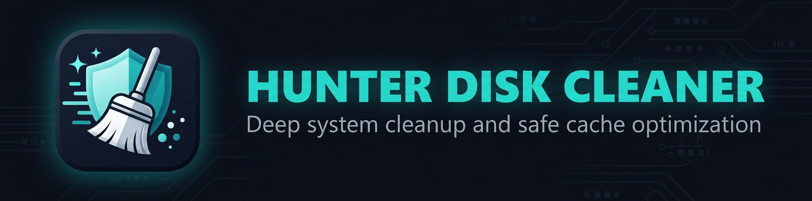

  

---

  
  
  
  

---

## 📖 Overview

**Hunter Disk Cleaner** is a modern, blazing-fast, and lightweight disk cleanup utility for Windows. Safely hunt down and remove hidden junk files to free up your computer storage instantly.

Unlike traditional opaque cleaners, Hunter features a **unified transparency interface** that shows you exactly what is being analyzed and gives you full control over your data, ensuring you know exactly how much space you can clean without any hidden surprises.

---

## ✨ Features

* **⚡ High-Speed Scanning:** Multi-threaded engine optimized to scan critical Windows junk zones in seconds.
* **🌐 Dynamic Localization:** Full native, real-time language switching supporting key international markets without restarting the app.
* **🔄 Auto-Update Engine:** Built-in seamless updates directly integrated with GitHub Releases.
* **🛡️ Safety First:** Carefully curated trash zones to ensure system stability—no accidental deletion of important personal files.
* **💎 Clean UI/UX:** Dark-themed modern WPF interface designed for clarity and ease of use.

---

## 🌐 Supported Languages (Localization)

Hunter Disk Cleaner is built for a global audience. The interface adapts instantly to major global markets and can be dynamically changed on the fly through the options menu:

* 🇺🇸 **English** (`en-US` - Core Fallback)
* 🇬🇧 **English (UK)** (`en-GB`)
* 🇧🇷 **Português (BR)** (`pt-BR`)
* 🇵🇹 **Português (PT)** (`pt-PT`)
* 🇪🇸 **Español** (`es-ES`)
* 🇩🇪 **Deutsch** (`de-DE`)
* 🇫睿 **Français** (`fr-FR`)
* 🇮🇹 **Italiano** (`it-IT`)
* 🇮🇩 **Bahasa Indonesia** (`id-ID`)
* 🇻🇳 **Tiếng Việt** (`vi-VN`)
* 🇷🇺 **Русский** (`ru-RU`)
* 🇨🇳 **简体中文** (`zh-CN`)
* 🇹🇼 **繁體中文** (`zh-TW`)
* 🇯🇵 **日本語** (`ja-JP`)
* 🇰🇷 **한국어** (`ko-KR`)
* 🇸🇦 **العربية** (`ar-SA` - RTL Compatible)

---

## 🏁 Free vs. PRO Version

We believe in **absolute transparency**. The application clearly displays how much space can be recovered so you are always in the loop.

| Feature | Free Edition | PRO Edition |
| :--- | :---: | :---: |
| Core Windows Junk Removal (Temp, Log files) | ✅ | ✅ |
| Real-time Selection & Potential Purge Counter | ✅ | ✅ |
| Multi-language Support & Dynamic Switching | ✅ | ✅ |
| Integrated Auto-Updates | ✅ | ✅ |
| Advanced Trash Zones (Browser Cache, System Leftovers) | 🔒 View Only | ✅ |
| One-Click Total Optimization | ❌ | ✅ |
| Priority Support & Updates | ❌ | ✅ |

### 🔑 Get your PRO License & Support

To unlock the full potential of Hunter Disk Cleaner, you can request your PRO license activation or get technical assistance through our official channels:

* 🌐 **Official Website:** [hunterdiskcleaner.com](https://hunterdiskcleaner.com)
* 🔑 **PRO License Request:** [Request via Web Form](https://hunterdiskcleaner.com/pro.html)
* ✉️ **Contact & Support:** [Open a Support Ticket](https://hunterdiskcleaner.com/contact.html) or contact us directly at **contact@hunterdiskcleaner.com**

---

## 🚀 Installation & Updates

Hunter Disk Cleaner features an autonomous update pipeline:
1. **[Click here to go to the Releases page and download the latest version](https://github.com/workflowtech/hunterdiskcleaner/releases)**
2. Run the installer and launch the application.
3. When a new version is published, the app will automatically notify you and seamlessly apply the update.
    
---

  <i>Hunter Disk Cleaner is built with continuous improvement (Kaizen) mindsets. Safely hunting junk, pixel by pixel.</i>

